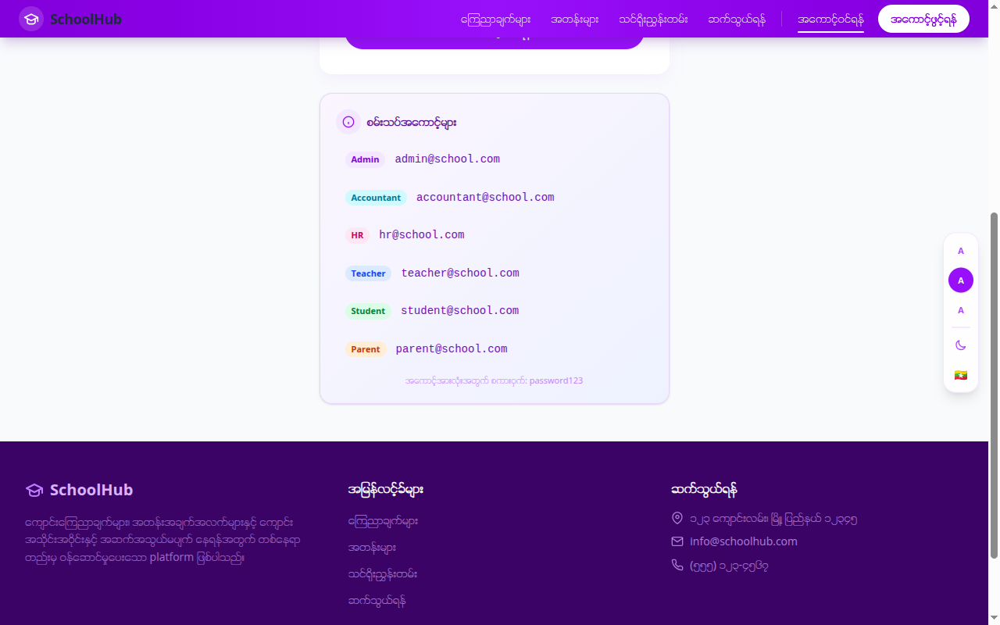
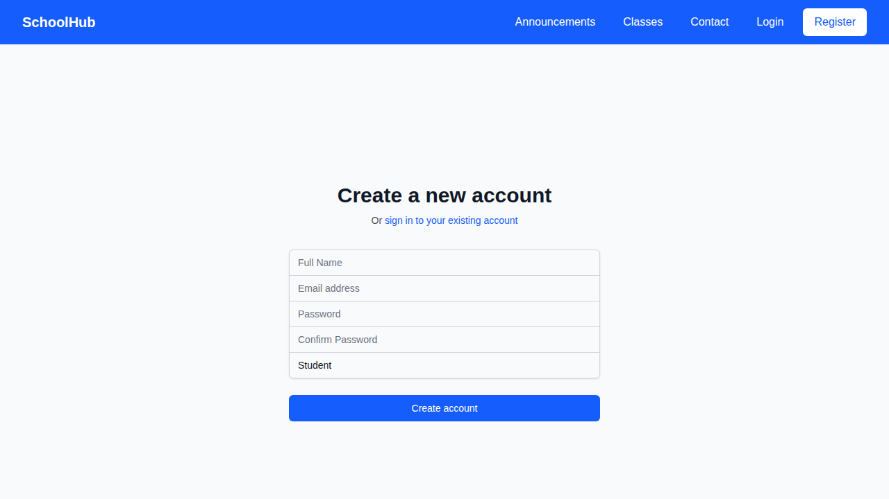
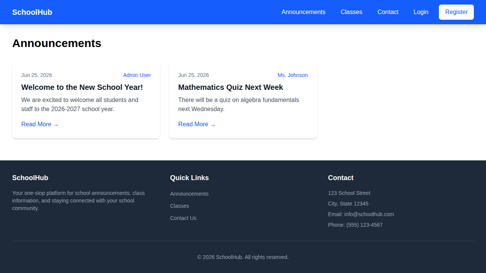
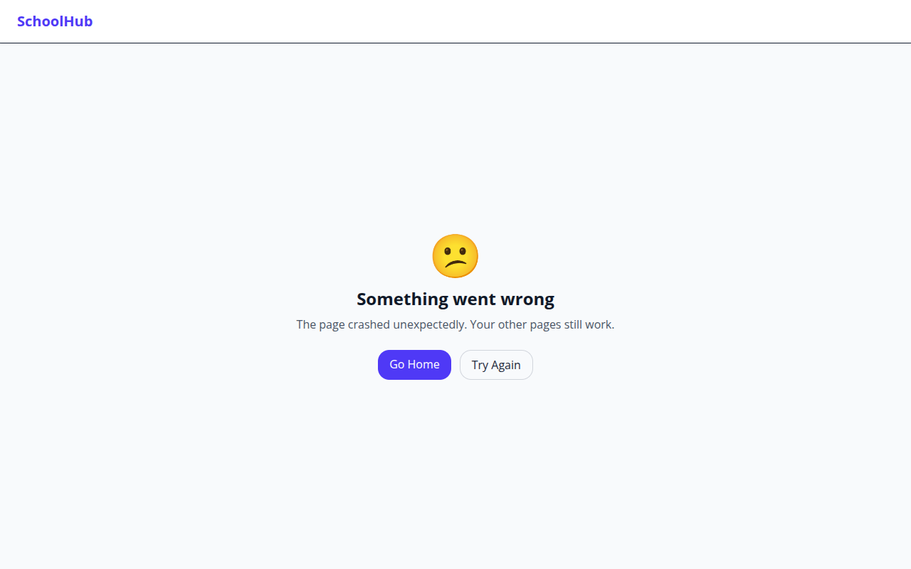
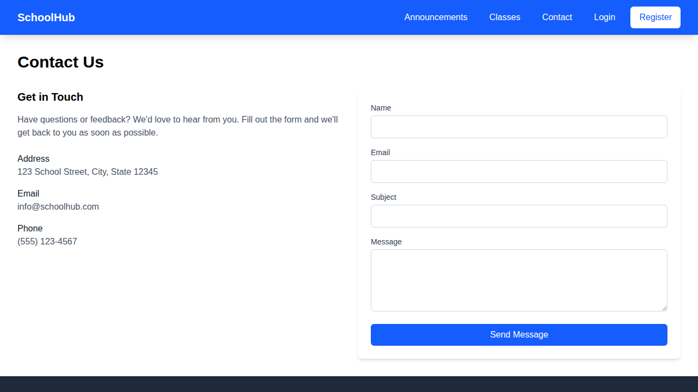
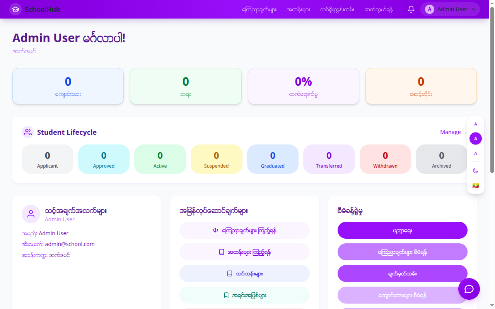

# 🏫 School Information System

A full-stack school management application built with React, Express, and SQLite.

## Features

- **Student Management** — Register, view, and manage student records
- **Teacher Management** — Teacher profiles and assignments
- **Attendance Tracking** — Daily attendance with present/absent/late/leave status
- **Timetable** — Class scheduling and timetable view
- **Courses & Curriculum** — Course management with subject mapping
- **Assignments & Quizzes** — Create, submit, and grade assessments
- **Gradebook** — GPA tracking and final grade computation
- **Reports** — School overview stats and individual student report cards
- **Announcements** — School-wide announcements with comments
- **Chat Assistant** — AI-powered help widget
- **Multi-language** — English and Myanmar language support

## Tech Stack

| Layer | Technology |
|-------|-----------|
| Frontend | React + Vite + Tailwind CSS |
| Backend | Express.js + better-sqlite3 |
| Auth | JWT with role-based access (admin, teacher, student) |
| Deployment | Vercel (serverless) |

## Screenshots

### Homepage


### Login


### Register


### Announcements


### Classes


### Contact


### Dashboard


## Getting Started

### Prerequisites
- Node.js 18+
- npm

### Installation

```bash
# Install dependencies
npm install

# Start development servers
npm run dev
```

This starts both the client (port 5173) and server (port 5000).

### Default Login

| Role | Email | Password |
|------|-------|----------|
| Admin | admin@school.com | admin123 |
| Teacher | teacher@school.com | teacher123 |
| Student | student@school.com | student123 |

## Project Structure

```
├── client/          # React frontend
│   └── src/
│       ├── components/
│       ├── context/
│       ├── pages/
│       └── services/
├── server/          # Express backend
│   ├── routes/
│   ├── middleware/
│   └── db.js
├── screenshots/     # App screenshots
└── vercel.json      # Deployment config
```

## License

MIT
# redeploy
