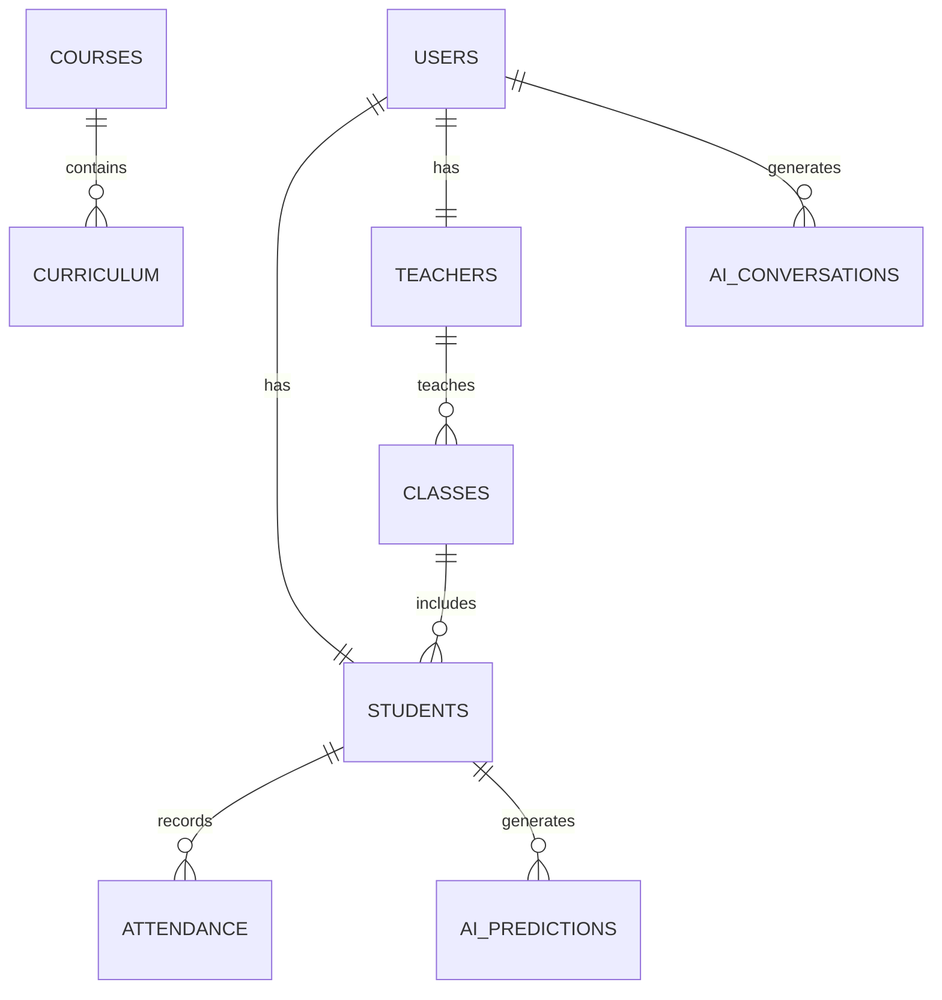

# Part 4 — Database Design, API Specification, Security & Deployment Architecture

---

# 4.1 System Context

This architecture is based on an existing School Management Web Application that already includes:

- Calendar Management
- Event Management
- Staff Management
- Teacher Management
- Student Management
- Course & Curriculum Management :contentReference[oaicite:1]{index=1}

The goal of this phase is to **extend the system with AI-ready data structures, secure APIs, and scalable deployment architecture**.

---

# 4.2 Database Design (Core Relational Schema)

The system uses **PostgreSQL** as the primary database with optional **vector extension (pgvector)** for AI features.

---

## 4.2.1 Core Tables

### Users Table

| Field         | Type      | Description                        |
| ------------- | --------- | ---------------------------------- |
| id            | UUID      | Primary Key                        |
| name          | VARCHAR   | Full name                          |
| email         | VARCHAR   | Unique login email                 |
| password_hash | TEXT      | Encrypted password                 |
| role          | ENUM      | admin / teacher / student / parent |
| created_at    | TIMESTAMP | Account creation                   |
| updated_at    | TIMESTAMP | Last update                        |

---

### Students Table

| Field           | Type              |
| --------------- | ----------------- |
| id              | UUID              |
| user_id         | UUID              |
| student_code    | VARCHAR           |
| class_id        | UUID              |
| date_of_birth   | DATE              |
| enrollment_date | DATE              |
| status          | ACTIVE / INACTIVE |

---

### Teachers Table

| Field                  | Type    |
| ---------------------- | ------- |
| id                     | UUID    |
| user_id                | UUID    |
| subject_specialization | TEXT    |
| workload_score         | FLOAT   |
| availability_status    | BOOLEAN |

---

### Classes Table

| Field       | Type    |
| ----------- | ------- |
| id          | UUID    |
| name        | VARCHAR |
| grade_level | INT     |
| section     | VARCHAR |

---

### Attendance Table

| Field      | Type                    |
| ---------- | ----------------------- |
| id         | UUID                    |
| student_id | UUID                    |
| date       | DATE                    |
| status     | PRESENT / ABSENT / LATE |

---

### Courses Table

| Field       | Type    |
| ----------- | ------- |
| id          | UUID    |
| name        | VARCHAR |
| description | TEXT    |
| credits     | INT     |

---

### Curriculum Table

| Field             | Type    |
| ----------------- | ------- |
| id                | UUID    |
| course_id         | UUID    |
| topic             | TEXT    |
| week_number       | INT     |
| completion_status | BOOLEAN |

---

## 4.2.2 AI & Vector Tables

### AI Conversations

| Field     | Type      |
| --------- | --------- |
| id        | UUID      |
| user_id   | UUID      |
| role      | TEXT      |
| message   | TEXT      |
| response  | TEXT      |
| timestamp | TIMESTAMP |

---

### Embeddings Table (RAG)

| Field       | Type   |
| ----------- | ------ |
| id          | UUID   |
| source_type | TEXT   |
| source_id   | UUID   |
| embedding   | VECTOR |
| metadata    | JSONB  |

---

### AI Predictions Table

| Field               | Type  |
| ------------------- | ----- |
| id                  | UUID  |
| student_id          | UUID  |
| risk_score          | FLOAT |
| dropout_probability | FLOAT |
| performance_trend   | JSONB |

---

# 4.3 Entity Relationship Diagram (ERD)



---

# 4.4 API Architecture

The system follows **REST + AI Gateway Architecture**.

---

## 4.4.1 Authentication APIs

### POST /api/auth/login

Login user

### POST /api/auth/register

Register new user

### POST /api/auth/refresh

Refresh token

---

## 4.4.2 Student APIs

### GET /api/students

Retrieve all students

### GET /api/students/{id}

Get student details

### POST /api/students

Create student

### PUT /api/students/{id}

Update student

---

## 4.4.3 Attendance APIs

### POST /api/attendance

Mark attendance

### GET /api/attendance/student/{id}

Get attendance history

---

## 4.4.4 AI APIs

### POST /api/ai/chat

Input:

```json
{
  "message": "Show at-risk students in Grade 5"
}
```

Output:

```json
{
  "response": "3 students identified with high risk score",
  "confidence": 0.92
}
```

---

### POST /api/ai/predict/student-risk

---

### POST /api/ai/generate/report

---

### POST /api/ai/schedule

AI-powered timetable generation

---

# 4.5 Security Architecture

---

## 4.5.1 Authentication

- JWT-based authentication
- Refresh token rotation
- Password hashing (bcrypt/argon2)

---

## 4.5.2 Authorization (RBAC)

| Role      | Permissions         |
| --------- | ------------------- |
| Admin     | Full access         |
| Principal | Analytics + reports |
| Teacher   | Class data          |
| Student   | Own data            |
| Parent    | Child data          |

---

## 4.5.3 Data Protection

- AES-256 encryption at rest
- TLS 1.3 for data in transit
- PII masking before AI processing

---

## 4.5.4 AI Security Layer

- Prompt injection detection
- Input sanitization
- Output filtering
- Human approval for sensitive actions

---

# 4.6 Deployment Architecture

---

## System Architecture

```
Frontend (React)
    ↓
API Gateway (Node/Laravel)
    ↓
AI Orchestration Service
    ↓
Microservices Layer
    ↓
Database Layer (PostgreSQL)
    ↓
Vector DB (pgvector)
```

---

## Infrastructure

| Component | Technology         |
| --------- | ------------------ |
| Frontend  | React + TypeScript |
| Backend   | Node.js / Laravel  |
| Database  | PostgreSQL         |
| Cache     | Redis              |
| AI Layer  | Claude API         |
| Vector DB | pgvector           |
| Queue     | RabbitMQ / Kafka   |

---

# 4.7 CI/CD Pipeline

---

## Pipeline Flow

```
Code Push
   ↓
GitHub Actions
   ↓
Unit Tests
   ↓
Security Scan
   ↓
Build Docker Image
   ↓
Deploy to Staging
   ↓
AI Regression Testing
   ↓
Production Deployment
```

---

## Environments

| Environment | Purpose     |
| ----------- | ----------- |
| Dev         | Development |
| Staging     | Testing     |
| Production  | Live system |

---

# 4.8 Observability & Monitoring

---

## Logging

- Centralized logs (ELK Stack)
- AI interaction logs
- Audit trails

---

## Metrics

- API latency
- AI response time
- Prediction accuracy
- System uptime

---

## Alerts

- High error rate
- AI failure rate
- Database latency spikes

---

# 4.9 Scalability Design

---

## Horizontal Scaling

- Stateless backend services
- Load balancer (Nginx / AWS ALB)
- Auto-scaling groups

---

## AI Scaling Strategy

- Cache frequent AI queries
- Batch processing for predictions
- Async AI processing for reports

---

# 4.10 Summary

This section defines the **technical foundation of the system**, including:

✔ Complete database design  
✔ AI-ready schema extensions  
✔ REST API architecture  
✔ Security & RBAC model  
✔ Deployment architecture  
✔ CI/CD pipeline  
✔ Observability strategy  
✔ Scalability plan

---

# Final Statement

The system is now fully structured for:

- Enterprise deployment
- AI integration
- Multi-user scalability
- Secure school data handling
- Production-grade operations

---

**End of Part 4**
